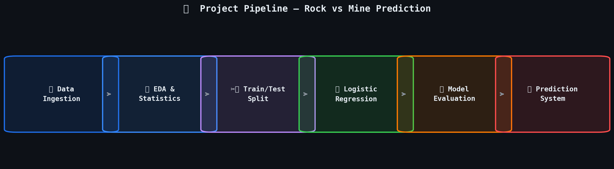
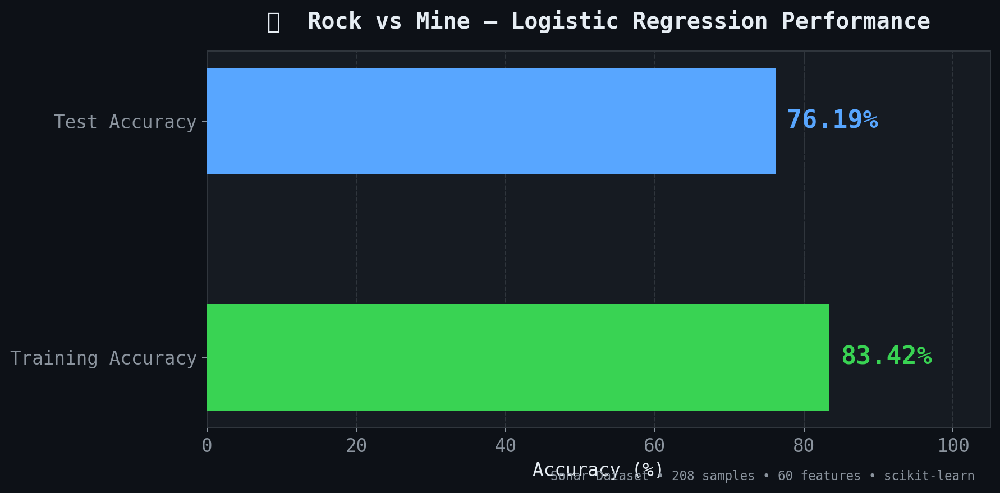
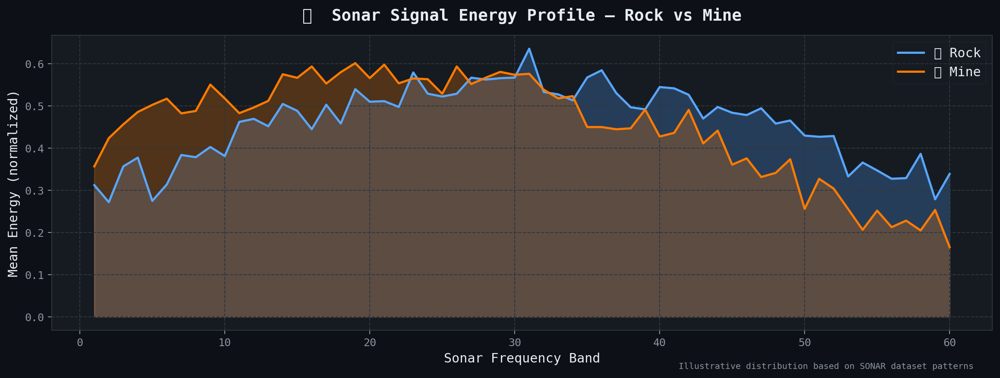

<div align="center">

# 🪨 Rock vs Mine Prediction
### Binary Classification using SONAR Data & Logistic Regression

[](https://python.org)
[](https://scikit-learn.org)
[](https://pandas.pydata.org)
[](https://numpy.org)
[](https://jupyter.org)



</div>

---

## 📌 Overview

This project builds a **binary classification model** to determine whether an underwater object detected by sonar is a **Rock** or a **Mine** — a real-world problem relevant to naval defence and underwater robotics.

Using the **UCI SONAR dataset** (208 samples × 60 frequency-band features), a **Logistic Regression** model is trained and evaluated to classify sonar signal returns with solid accuracy.

---

## 📊 Results

<div align="center">



| Metric | Score |
|--------|-------|
| **Training Accuracy** | 83.42% |
| **Test Accuracy** | 76.19% |
| **Algorithm** | Logistic Regression |
| **Train / Test Split** | 90% / 10% (stratified) |

</div>

---

## 🌊 Sonar Signal Analysis

<div align="center">



</div>

The chart above shows the **mean sonar energy per frequency band** for Rocks vs Mines. The distinct signal profiles across the 60 bands are what the model learns to differentiate.

---

## 📁 Project Structure

```
Rock-vs-Mine-Prediction/
│
├── 📓 Rock_vs_Mine_Prediction.ipynb   # Main notebook (EDA + Training + Evaluation)
├── 📄 sonar data.csv                  # UCI SONAR dataset (208 × 61)
├── 🖼️ images/                         # Visualisations & charts
│   ├── chart1_accuracy.png
│   ├── chart2_pipeline.png
│   └── chart3_signals.png
└── 📋 README.md
```

---

## 🧠 How It Works

```
SONAR Signal (60 frequency bands)
         │
         ▼
  Data Preprocessing
  (feature/label split, stratified train-test split)
         │
         ▼
  Logistic Regression Model
  (trained on 187 samples)
         │
         ▼
  Prediction → Rock (R) or Mine (M)
```

---

## 🗃️ Dataset

- **Source:** [UCI Machine Learning Repository — Connectionist Bench (Sonar)](https://archive.ics.uci.edu/ml/datasets/connectionist+bench+(sonar,+mines+vs.+rocks))
- **Samples:** 208 (111 Mines, 97 Rocks)
- **Features:** 60 continuous sonar frequency-band energy values (range 0.0 – 1.0)
- **Label:** `M` = Mine, `R` = Rock

---

## ⚙️ Setup & Usage

### 1. Clone the repository
```bash
git clone https://github.com/Amankumar8050/Rock-vs-Mine-Prediction.git
cd Rock-vs-Mine-Prediction
```

### 2. Install dependencies
```bash
pip install numpy pandas scikit-learn matplotlib seaborn jupyter
```

### 3. Run the notebook
```bash
jupyter notebook Rock_vs_Mine_Prediction.ipynb
```

### 4. Quick prediction (from Python)
```python
import numpy as np
from sklearn.linear_model import LogisticRegression

# After training the model...
sample = [0.0307, 0.0523, ..., 0.0055]   # 60 sonar values
arr    = np.asarray(sample).reshape(1, -1)
pred   = model.predict(arr)[0]
print("Rock" if pred == "R" else "Mine")
```

---

## 🚀 Future Improvements

- [ ] Apply `StandardScaler` for feature normalisation
- [ ] Tune regularisation parameter `C` to reduce train-test gap
- [ ] Benchmark against SVM, Random Forest, and XGBoost
- [ ] Add cross-validation (k-fold) for more robust evaluation
- [ ] Deploy as a simple web app using Streamlit

---

## 👨‍💻 Author

**Aman Kumar**
B.Tech CSE (AI & ML) ||
Government Engineering College Khagaria


[](https://linkedin.com/in/amankumar913)
[](https://github.com/Amankumar8050)

---

<div align="center">

⭐ **Star this repo if you found it useful!**

</div>
